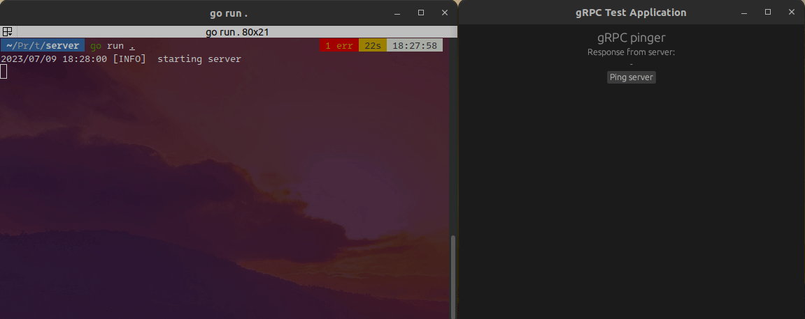

# EGUI gRPC #

[](https://github.com/zpervan/egui_grpc_example/actions/workflows/ubuntu_client.yml) [](https://github.com/zpervan/egui_grpc_example/actions/workflows/ubuntu_server.yml) 

A minimal example project that contains a client-server gRPC application made with EGUI (Rust) and Go.

NOTE: Works on Ubuntu22.04, not sure about other OSs.



## Setup ##

### Client ###
- Install the Rust development [environment](https://www.rust-lang.org/tools/install)

### Server ###
- Install the latest Go version
- Add [protoc 21.6](https://github.com/protocolbuffers/protobuf/releases/download/v21.6/protoc-21.6-linux-x86_64.zip) in order to compile the `protobuf` files (copy the bin file into `/usr/bin` for proper usage)
- Navigate to `server` in your terminal and install the `protobuf` plugins for `Golang`:
```shell
go install google.golang.org/protobuf/cmd/protoc-gen-go
go get google.golang.org/grpc/cmd/protoc-gen-go-grpc
go install google.golang.org/grpc/cmd/protoc-gen-go-grpc
```

## Generate `protobuf` files ##
To do this successfully, the `protobuf` dependencies should be installed as previously described. 
For the **server**, position the terminal into `proto_messages` and execute the following:
```shell
protoc --go_out=../backend --go-grpc_out=../backend *.proto
```
The **client** should be generated with the `build.rs` during the application build so no additional steps required.

For more information, you can have a look [this](https://itnext.io/build-grpc-server-with-golang-go-step-by-step-b3f5abcf9e0e) blog post.

## Run ##

- Make sure the `protobuf` files are previously generated
- Navigate to `server` and execute:
```shell
go run .
```
- To run the EGUI application, navigate to the `client` folder and type the following:
```shell
cargo run --release
```
